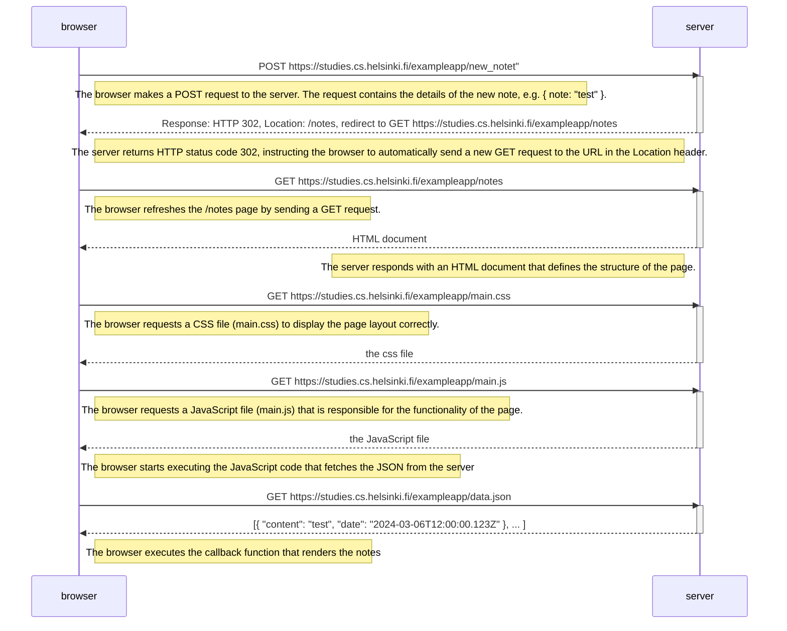

# Osan 0 tehtävien vastaukset

## 0.4: uusi muistiinpano

```mermaid
sequenceDiagram
    participant browser
    participant server
    
    browser->>server: POST https://studies.cs.helsinki.fi/exampleapp/new_notet"
    activate server

    Note right of browser: The browser makes a POST request to the server. The request contains the details of the new note, e.g. { note: "test" }.

    server-->>browser: Response: HTTP 302, Location: /notes, redirect to GET https://studies.cs.helsinki.fi/exampleapp/notes
    deactivate server

    Note left of server: The server returns HTTP status code 302, instructing the browser to automatically send a new GET request to the URL in the Location header.

    browser->>server: GET https://studies.cs.helsinki.fi/exampleapp/notes
    activate server

    Note right of browser: The browser refreshes the /notes page by sending a GET request.

    server-->>browser: HTML document
    deactivate server

    Note left of server: The server responds with an HTML document that defines the structure of the page.

    browser->>server: GET https://studies.cs.helsinki.fi/exampleapp/main.css
    activate server

    Note right of browser: The browser requests a CSS file (main.css) to display the page layout correctly.

    server-->>browser: the css file
    deactivate server
    
    browser->>server: GET https://studies.cs.helsinki.fi/exampleapp/main.js
    activate server

    Note right of browser: The browser requests a JavaScript file (main.js) that is responsible for the functionality of the page.

    server-->>browser: the JavaScript file
    deactivate server
    
    Note right of browser: The browser starts executing the JavaScript code that fetches the JSON from the server
    
    browser->>server: GET https://studies.cs.helsinki.fi/exampleapp/data.json
    activate server
    server-->>browser: [{ "content": "test", "date": "2024-03-06T12:00:00.123Z" }, ... ]
    deactivate server    

    Note right of browser: The browser executes the callback function that renders the notes 
```
